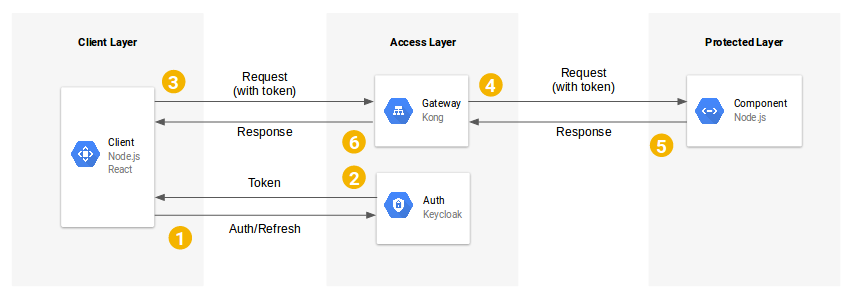

# Microservices architecture with Kong API Gateway and Keycloak integration

## Context

The modularity that microservice architectures allow for means that code (ie, individual components) can be reused in multiple scenarios. For example, a component managing customer subscriptions can be reused in many different applications whose business logic requires it. However, departing from monolithic architectures comes along with some challenges revolving around 1) managing and 2) securing components.

In monolithic architectures it’s fairly straightforward (think libraries) to implement features such as user authentication, request/response logging, rate-limiting and so on. But what happens when the business logic is broken down to multiple modular components?

One approach is to establish guidelines for component developers on what libraries to use and how to implement features such as authentication or request/response logging. But that can be a nuisance, especially as the number of components increases. And what if, down the line, it is decided that a different authentication or logging mechanism is used? In that scenario, component developers would have to go through each of their components to make the necessary changes in their code to account for the new decisions.

Fortunately, there are open-source solutions that provide out-of-the-box robust API management (such as the Kong gateway) as well as user management and authentication (such as the Keycloak authentication suite) that help avoid these issues.

The goal of this project is hence to setup a basic microservice environment using Kong as a gateway and Keycloak as the authentication suite. The end result will thus look something like this:

## Getting Started

Clone this repository to your local machine

============== Creationg Node apps containers:

cd serverApp

docker build -t node-server-image .

docker run --name node-server-container -p 3001:3001 -d node-server-image

cd clientApp

docker build -t node-client-image .

docker run --name node-client-container -p 3000:3000 -d node-client-image

================ Create docker network

docker network create neoxia-net

================ Create Cassandra DB

docker run -d --name neoxia-database \
               --network=neoxia-net \
               -p 9042:9042 \
               cassandra:3

================ Configure Cassandra for Kong

docker run --rm \
     --network=neoxia-net \
     -e "KONG_DATABASE=cassandra" \
     -e "KONG_CASSANDRA_KEYSPACE=neoxia" \
     -e "KONG_CASSANDRA_CONTACT_POINTS=neoxia-database" \
     kong:latest kong migrations bootstrap

================ Run Kong Container

docker run -d --name neoxia-container\
     --network=neoxia-net \
     -e "KONG_DATABASE=cassandra" \
     -e "KONG_CASSANDRA_KEYSPACE=neoxia" \
     -e "KONG_CASSANDRA_CONTACT_POINTS=neoxia-database" \
     -e "KONG_ADMIN_LISTEN=0.0.0.0:8001, 0.0.0.0:8444 ssl" \
     -p 8000:8000 \
     -p 8443:8443 \
     -p 8001:8001 \
     -p 8444:8444 \
     kong:latest

================ Run Keycloak Container

docker run \
  -e KEYCLOAK_USER=admin \
  -e KEYCLOAK_PASSWORD=admin \
  --name keycloak \
  -p 8080:8080 \
  jboss/keycloak

--- Adding service to kong:

curl -i -X POST \
  --url http://localhost:8001/services/ \
  --data 'name=neoxia-service-v1' \
  --data 'url=http://@node-server-container:3001/data'
  
--- Ading route to the service:

curl -i -X POST \
  --url http://localhost:8001/services/neoxia-service-v1/routes \
  --data 'paths[]=/data'

--- Adding jwt plugin to the neoxia-service-v1 service

curl -i -X POST --url http://localhost:8001/services/neoxia-service-v1/plugins/ --data 'name=jwt'

--- Adding kong consumer

curl -X POST http://localhost:8001/consumers --data "username=demo-consumer"

CONSUMER_ID=629b99cb-bc22-41a0-bec5-dbe7872db7c5

TOKEN_ISSUER="http://localhost:8080/auth/realms/demo-realm"

RSA_PUB_KEY=`cat mykey-pub.pem`

curl -X POST http://localhost:8001/consumers/$CONSUMER_ID/jwt \
  --data "key=$TOKEN_ISSUER" \
  --data "algorithm=RS256" \
  --data-urlencode "rsa_public_key=$RSA_PUB_KEY"

--- Adding Cors

curl -X POST http://localhost:8001/services/neoxia-service-v1/plugins/ \
  --data "name=cors" \
  --data "config.origins=http://localhost:3000/*" \
  --data "config.methods=GET" \
  --data "config.headers=Accept, Accept-Version, Content-Length, Content-MD5, Content-Type, Date, Authorization" \
  --data "config.exposed_headers=Authorization" \
  --data "config.credentials=true" \
  --data "config.max_age=3600"
