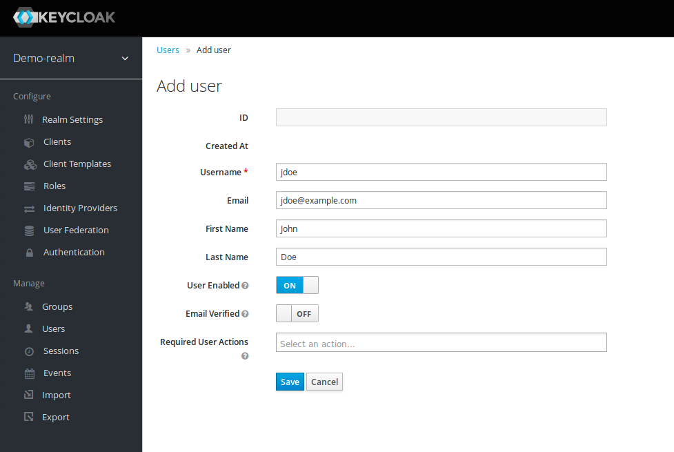
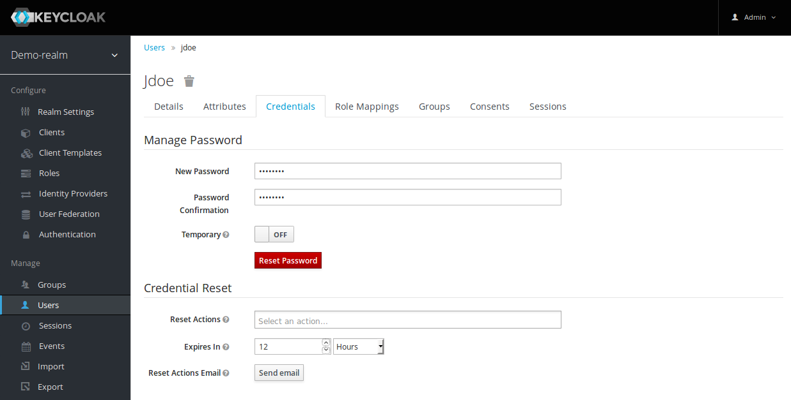
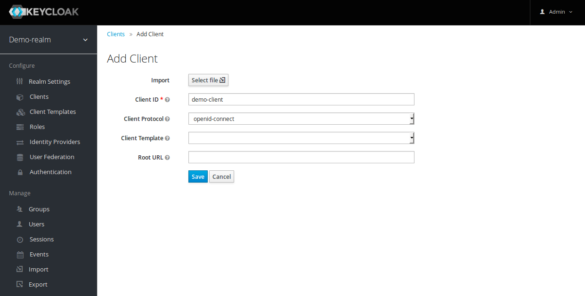

# Microservices architecture with Kong API Gateway and Keycloak integration

## Context

The modularity that microservice architectures allow for means that code (ie, individual components) can be reused in multiple scenarios. For example, a component managing customer subscriptions can be reused in many different applications whose business logic requires it. However, departing from monolithic architectures comes along with some challenges revolving around 1) managing and 2) securing components.

In monolithic architectures it’s fairly straightforward (think libraries) to implement features such as user authentication, request/response logging, rate-limiting and so on. But what happens when the business logic is broken down to multiple modular components?

One approach is to establish guidelines for component developers on what libraries to use and how to implement features such as authentication or request/response logging. But that can be a nuisance, especially as the number of components increases. And what if, down the line, it is decided that a different authentication or logging mechanism is used? In that scenario, component developers would have to go through each of their components to make the necessary changes in their code to account for the new decisions.

Fortunately, there are open-source solutions that provide out-of-the-box robust API management (such as the Kong gateway) as well as user management and authentication (such as the Keycloak authentication suite) that help avoid these issues.

The goal of this project is hence to setup a basic microservice environment using Kong as a gateway and Keycloak as the authentication suite. The end result will thus look something like this:


1. Upon trying to access a protected endpoint, the user is redirected to the Keycloak login page if there is no active session.
2. Keycloak issues an access and refresh token to the user, which are also cached by the client and used in subsequent requests to protected components.
3. The client can now access protected components behind the Kong gateway by filling the Authorization HTTP header with the access token (or use the refresh token to request a new access token from Keycloak if the old access token has expired).
4. The Kong gateway validates the access token, the signature, the issuers, and the expiration time. If the validation is successful, the request proceeds to the protected component.
5. The protected component can decode the access token for extra context on the user (eg. role, username, etc.), before sending a response.
6. The Kong gateway then forwards the response back to the client.


## Getting Started

First, Clone this repository to your local machine

### Setup Kong
#### 1.1 Initialize database
Kong can interface with either Cassandra or Postgres. I this example we will use Cassandra DB.
```
docker run -d --name neoxia-database \
               --network=neoxia-net \
               -p 9042:9042 \
               cassandra:3
```
Then prepare the database for Kong.
```
docker run --rm \
     --network=neoxia-net \
     -e "KONG_DATABASE=cassandra" \
     -e "KONG_CASSANDRA_KEYSPACE=neoxia" \
     -e "KONG_CASSANDRA_CONTACT_POINTS=neoxia-database" \
     kong:latest kong migrations bootstrap
```
#### 1.2 Initialize kong
```
docker run -d --name neoxia-container\
     --network=neoxia-net \
     -e "KONG_DATABASE=cassandra" \
     -e "KONG_CASSANDRA_KEYSPACE=neoxia" \
     -e "KONG_CASSANDRA_CONTACT_POINTS=neoxia-database" \
     -e "KONG_ADMIN_LISTEN=0.0.0.0:8001, 0.0.0.0:8444 ssl" \
     -p 8000:8000 \
     -p 8443:8443 \
     -p 8001:8001 \
     -p 8444:8444 \
     kong:latest
```
### Setup Keycloak
#### 2.1 Initialize Keycloak
```
docker run \
  -e KEYCLOAK_USER=admin \
  -e KEYCLOAK_PASSWORD=admin \
  --name keycloak \
  -p 8080:8080 \
  jboss/keycloak
```
#### 2.2 Configure Keycloak
##### 2.2.1 Create a Realm
A realm secures and manages metadata for a set of users, applications, and registered clients.

Navigate to the Keycloak admin interface at localhost:8080. Use the admin credentials passed to the Keycloak initialization routine in the previous section to login.

Hover over the default realm, an Add realm button will be displayed. Add a new realm demo-realm
##### 2.2.2 Create a User
Create a new user and navigate to the Credentials tab and enter a password.


##### 2.2.3 Create a Client
Clients map to the applications that belong to our realm.

Once the client is created, we’ll be redirected to the client settings view. Scroll down and add http://localhost:3000/* to the Valid Redirect URIs field. Also add http://localhost:3000 to the Web Origins field. Note that http://localhost:3000 is where our app client will be running on. A Valid Redirect URI is the location a browser redirects to after a successful login or logout. Adding our client host to the Web Origins field also ensures CORS is enabled.
### Setup the Protected Component
#### 3.1 Create the Component
Change location to the server application, build a new image and run a new containe
```
cd serverApp
docker build -t node-server-image .
docker run --name node-server-container -p 3001:3001 -d node-server-image
```
The server app is listned on port 3001 with endpoint /data: http://localhost:3001/data
#### 3.1 Declare the Component with Kong


============== Creationg Node apps containers:

cd serverApp

docker build -t node-server-image .

docker run --name node-server-container -p 3001:3001 -d node-server-image

cd clientApp

docker build -t node-client-image .

docker run --name node-client-container -p 3000:3000 -d node-client-image

================ Create docker network

docker network create neoxia-net

================ Create Cassandra DB

docker run -d --name neoxia-database \
               --network=neoxia-net \
               -p 9042:9042 \
               cassandra:3

================ Configure Cassandra for Kong

docker run --rm \
     --network=neoxia-net \
     -e "KONG_DATABASE=cassandra" \
     -e "KONG_CASSANDRA_KEYSPACE=neoxia" \
     -e "KONG_CASSANDRA_CONTACT_POINTS=neoxia-database" \
     kong:latest kong migrations bootstrap

================ Run Kong Container

docker run -d --name neoxia-container\
     --network=neoxia-net \
     -e "KONG_DATABASE=cassandra" \
     -e "KONG_CASSANDRA_KEYSPACE=neoxia" \
     -e "KONG_CASSANDRA_CONTACT_POINTS=neoxia-database" \
     -e "KONG_ADMIN_LISTEN=0.0.0.0:8001, 0.0.0.0:8444 ssl" \
     -p 8000:8000 \
     -p 8443:8443 \
     -p 8001:8001 \
     -p 8444:8444 \
     kong:latest

================ Run Keycloak Container

docker run \
  -e KEYCLOAK_USER=admin \
  -e KEYCLOAK_PASSWORD=admin \
  --name keycloak \
  -p 8080:8080 \
  jboss/keycloak

--- Adding service to kong:

curl -i -X POST \
  --url http://localhost:8001/services/ \
  --data 'name=neoxia-service-v1' \
  --data 'url=http://@node-server-container:3001/data'
  
--- Ading route to the service:

curl -i -X POST \
  --url http://localhost:8001/services/neoxia-service-v1/routes \
  --data 'paths[]=/data'

--- Adding jwt plugin to the neoxia-service-v1 service

curl -i -X POST --url http://localhost:8001/services/neoxia-service-v1/plugins/ --data 'name=jwt'

--- Adding kong consumer

curl -X POST http://localhost:8001/consumers --data "username=demo-consumer"

CONSUMER_ID=629b99cb-bc22-41a0-bec5-dbe7872db7c5

TOKEN_ISSUER="http://localhost:8080/auth/realms/demo-realm"

RSA_PUB_KEY=`cat mykey-pub.pem`

curl -X POST http://localhost:8001/consumers/$CONSUMER_ID/jwt \
  --data "key=$TOKEN_ISSUER" \
  --data "algorithm=RS256" \
  --data-urlencode "rsa_public_key=$RSA_PUB_KEY"

--- Adding Cors

curl -X POST http://localhost:8001/services/neoxia-service-v1/plugins/ \
  --data "name=cors" \
  --data "config.origins=http://localhost:3000/*" \
  --data "config.methods=GET" \
  --data "config.headers=Accept, Accept-Version, Content-Length, Content-MD5, Content-Type, Date, Authorization" \
  --data "config.exposed_headers=Authorization" \
  --data "config.credentials=true" \
  --data "config.max_age=3600"
